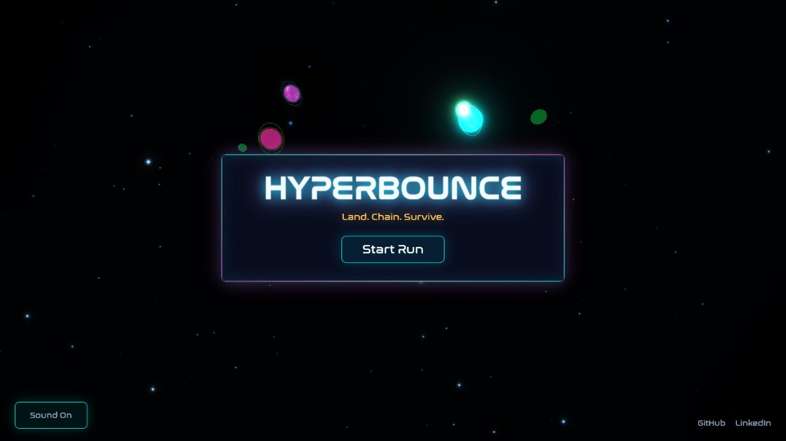
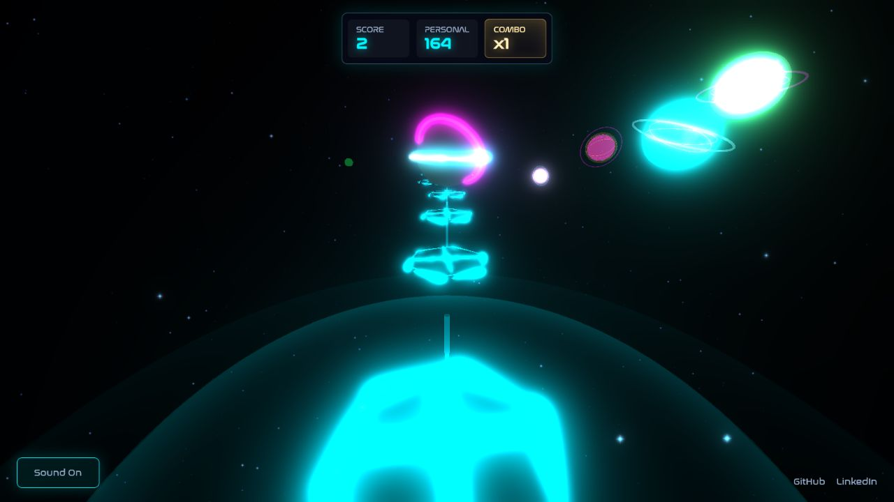
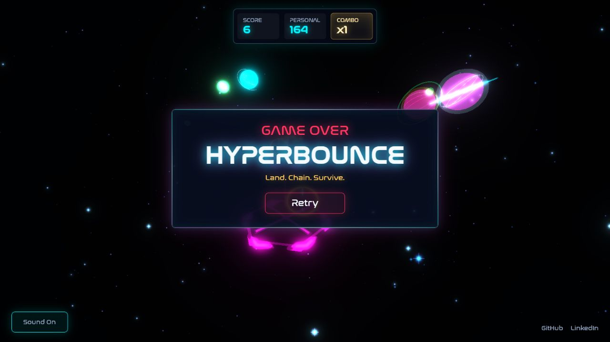

# Hyperbounce

Hyperbounce is a neon 3D arcade runner built with JavaScript and Three.js. Guide a bouncing energy core across incoming platforms, collect combo cores, and survive as the platform spacing, movement, and tempo become less forgiving.

[Play Hyperbounce](https://raymunozeng.github.io/Hyperbounce/)



| Active run | Gravity-rift game over |
| --- | --- |
|  |  |

## Play

Choose **Start Run**, then steer with the mouse or trackpad. Hyperbounce requests pointer lock during a run so lateral movement stays inside the game window; press `Escape` to release it.

- Land on each platform when the player returns to platform height.
- Collect the core on multiplier platforms to build the combo.
- Missing a multiplier core resets the combo; ordinary platforms do not.
- Red hazard platforms are safe landing targets and preserve the combo; narrow platforms reduce the landing area, and boost platforms award bonus score.
- Missing a platform opens the gravity rift and ends the run.

Personal bests are stored locally. The optional online service adds Google or email sign-in, an overall record, and a public top ten. Those controls stay hidden when the service is not configured.

## How It Works

### One clock for platforms and the player

The platform's actual position is the source of truth for the bounce phase. That keeps the visible player arc and collision target synchronized even when platform gaps and run speed change.

```js
export function resolvePlatformBouncePhase(
    platformZ,
    platformGap = Math.abs(GAME_CONFIG.platform.startZ),
    landingZ = GAME_CONFIG.platform.landingZ
) {
    const gap = positiveNumber(platformGap, Math.abs(GAME_CONFIG.platform.startZ));
    const z = Number.isFinite(Number(platformZ)) ? Number(platformZ) : landingZ - gap;

    return 1 + ((z - landingZ) / gap);
}
```

After every landing, the next platform's measured travel gap drives the next bounce. Spacing can vary without creating a separate visual timer that gradually drifts away from collision.

### Pooled procedural platforms

Platforms are created once and reused. Spawning activates an available platform, records its individual travel distance, and returns it to the active set.

```js
const platform = this.pool.find((candidate) => !candidate.active);

if (!platform) return null;

platform.activate(type, x, z, this.spawnIndex, motion);
platform.travelGap = Math.max(0.001, Math.abs(travelGap));
platform.isCleared = false;
this.active.push(platform);
this.spawnIndex += 1;
```

The pool prevents geometry and material allocation during the run. Stars, planets, platform rails, orbit bands, impact rings, and the player model are all assembled from shared Three.js primitives rather than downloaded character models.

### Adaptive GPU workload

The renderer tracks sustained frame pressure during launch, play, and death sequences. When the quality controller changes scale, the renderer and post-processing composer receive the same pixel ratio and logical dimensions.

```js
const pixelRatio = Math.max(0.35, basePixelRatio * (this.renderScale || 1));

this.renderer.setPixelRatio(pixelRatio);
this.renderer.setSize(width, height);
if (this.composer && this.composer.setSize) {
    if (this.composer.setPixelRatio) this.composer.setPixelRatio(pixelRatio);
    this.composer.setSize(width, height);
}
```

This keeps bloom and the primary render aligned while limiting fill-rate cost on dense or high-DPI displays.

### Seamless soundtrack loop

Two Howler tracks alternate near the end of the music file. The next copy starts at zero volume while the current copy fades out, so tempo and game-over pitch changes do not introduce a silent gap.

```js
fadingIn.volume(0);
fadingIn.play();
fadingIn.fade(0, this.volume, this.fadeMs);
fadingOut.fade(this.volume, 0, this.fadeMs);
```

The sound effects are generated assets with dedicated cues for launch, landing, pickups, misses, records, and the gravity-rift death sequence.

## Project Map

- `src/game.js` owns lifecycle, state transitions, the animation loop, and scoring orchestration.
- `src/config.js` contains the palette, physics, platform, launch, and difficulty tuning.
- `src/player.js` and `src/platform.js` contain the procedural gameplay models.
- `src/platform_generator.js` manages pooling, spacing, platform types, and moving-platform probability.
- `src/tempo.js`, `src/collision.js`, and `src/scoring.js` keep gameplay math pure and testable.
- `src/audio.js` manages generated cues, music crossfades, and pitch transitions.
- `src/effects.js` and `src/record_celebration.js` own ambient space and record effects.
- `src/render_quality.js` adapts GPU load from measured frame time.
- `src/input.js` contains pointer-lock and recovery behavior.
- `src/hud.js`, `src/auth.js`, and `src/leaderboard.js` isolate DOM and online-service behavior.
- `workers/leaderboard-worker.js` validates authenticated scores and stores the top ten.

## Local Development

Node.js 18 or newer is required.

```bash
npm install
npm test
npm run build
```

Serve the repository root with any static server, then open `index.html` through that server. During active development, `npm run watch` rebuilds `bundle.js` when source files change.

The tests use Node's built-in test runner and cover collision, scoring, platform timing, pointer-lock recovery, audio transitions, render-quality adaptation, records, authentication, leaderboard behavior, Worker origin rules, and the Pages release package.

## GitHub Pages

The Pages workflow runs tests, creates a production bundle, and stages only the files needed by the browser into `dist`. Source modules, tests, Worker code, package metadata, and `node_modules` are excluded from the uploaded artifact.

1. In the repository settings, set **Pages > Build and deployment > Source** to **GitHub Actions**.
2. Push to `master`, or run **Deploy Hyperbounce to GitHub Pages** manually from the Actions tab.
3. Leave `site-config.js` blank for local personal bests only, or add the public Worker URL, Supabase project URL, and Supabase anon key to enable online scores and sign-in.
4. Follow [workers/README.md](workers/README.md) to deploy the score service and restrict its accepted origins.

Never add a Supabase service-role key to `site-config.js`; browser configuration is public by definition.

## Stack

- Three.js and WebGL
- Howler.js and Web Audio
- Webpack 5
- Node test runner
- Optional Supabase Auth, Cloudflare Workers, and D1

Released under the [ISC license](LICENSE).
